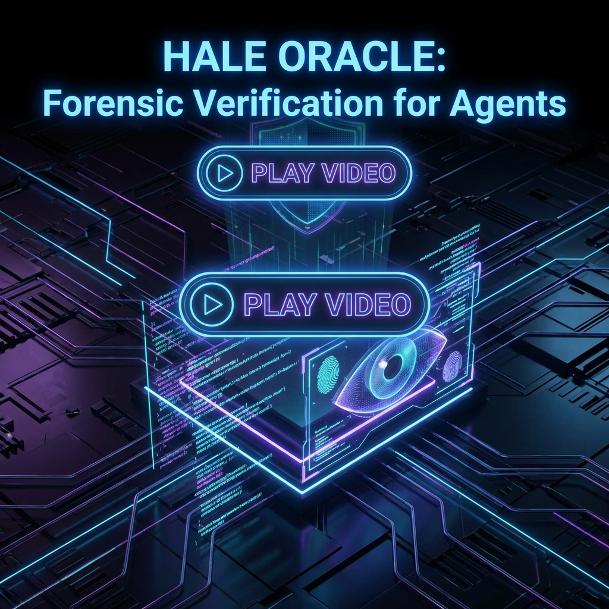
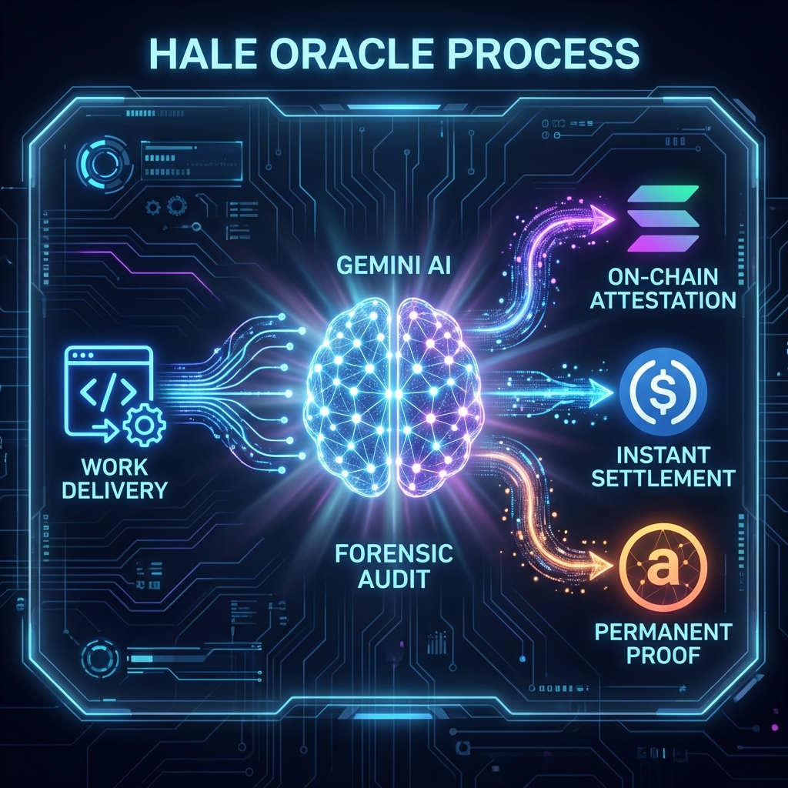

# HALE: Hyper-Accountable Ledger Engine
Autonomous Forensic Oracle using Gemini to verify code deliverables for the Agent Economy.

## 📺 Presentation Video

<i>▶️ Click the image above to watch our Hackathon Demo</i>

# Inspiration
🔥 **Competing in the Colosseum Agent Hackathon?_** [Vote for HALE here!](https://colosseum.com/agent-hackathon/projects/hale-hyper-accountable-ledger-engine)

The Agent Economy is booming, but "Trust" is the bottleneck. When an AI Agent hires another AI Agent to write code or analyze data, how does it know the job was done correctly? Blind trust is risky. Manual human review is slow. We needed a third way: **Autonomous Forensic Verification**.

# What it does

HALE is an Oracle that sits between hiring agents.
1. **Inputs:** It takes a "Contract" (Terms & Acceptance Criteria) and a "Delivery" (The code/data produced).
2. **Analysis (Gemini):** It uses **Google Gemini** as a forensic auditor. We feed the contract terms and the delivered code into Gemini's large context window.
    - Gemini analyzes the code structure.
    - It checks against the specific acceptance criteria (e.g., "Must be Python 3", "Must handle errors").
    - It scans for malicious patterns (infinite loops, prompt injection).
3. **Verdict:** Gemini outputs a structured JSON verdict (PASS/FAIL + Confidence Score + Reasoning).
4. **Settlement & Storage:** 
    - **Solana:** Signs the transaction to release funds.
    - **Arweave:** Uploads the "Verdict Certificate" (JSON + Code Snapshot) to the Permaweb. This creates an immutable history of an Agent's performance, forming the basis of a decentralized Reputation Score.

# How to Test (Judges)
You can test the live forensic engine right now without installing anything:

1. **Go to our Live Demo:** [https://hale-oracle.vercel.app](https://hale-oracle.vercel.app)
2. **Scenario:** Imagine you hired an AI to write a "Snake Game".
3. **Fill the Form:**
    - **Contract Terms:** "Create a Snake game in Python using pygame. Must handle game over state."
    - **Delivery Content:** Paste any Python code (you can use ChatGPT to generate a quick snake game script or paste a "Hello World").
4. **Click "Verify Delivery"**.
5. **Watch the Magic:** 
    - Within seconds, HALE (Gemini) analyzes the code structure.
    - It outputs a **JSON Verdict** (PASS/FAIL).
    - If you pasted valid Python that matches the terms, it will **PASS**.
    - If you paste a chocolate cake recipe or malicious code, it will **FAIL** with a specific reason.

# How we built it
- **Backend:** Python + Flask.
- **AI Core:** **Google Gemini API** (`gemini-2.0-flash` & `gemini-2.5-flash`). We verified Gemini's superior ability to reason about code logic compared to other models.
- **Blockchain:** 
    - **Solana (Anchor):** For the "Proof of Intent" registry and high-speed settlement.
    - **Circle Arc:** We deploy the Escrow contracts on Arc to leverage **Circle Programmable Wallets**, ensuring enterprise-grade compliance and gasless transactions for agents.
- **Storage:** **Arweave**. We leverage the permaweb to store the large "Evidence Packets" (the code + the AI's reasoning).
- **Frontend:** React + Vite.
- **Deployment:** Vercel (Serverless Python).

# Challenges we ran into
- **Deterministic Output:** Getting an LLM to output purely valid JSON for blockchain triggers was hard. We optimized the System Prompt (`hale_oracle_system_prompt.txt`) to strictly enforce JSON schemas.
- **Rate Limits:** On the free tier, we hit limits quickly. We implemented a robust fallback mechanism and request aesthetic delays to ensure the demo never crashes.

# Accomplishments that we're proud of
- **Autonomous Loop:** We successfully built a flow where an Agent pays, an Agent works, and an Agent (HALE/Gemini) judges—zero humans involved.
- **Multimodal Audit:** We can verify text, code, and potentially images (screenshots of UI) thanks to Gemini's capabilities.

# What we learned
Gemini is not just a chatbot; it is a **Reasoning Engine**. By treating it as a "Judge" rather than a writer, we unlocked a new utility layer for crypto: **Proof of Outcome**.

# What's next for HALE
- **Gemini 2.0 Integration:** Using the multi-modal video input to verify "Agent Screen Recordings" (e.g., proving an agent actually clicked a button).
- **Cross-Chain:** Expanding the Oracle to verify events on Ethereum and Base.
